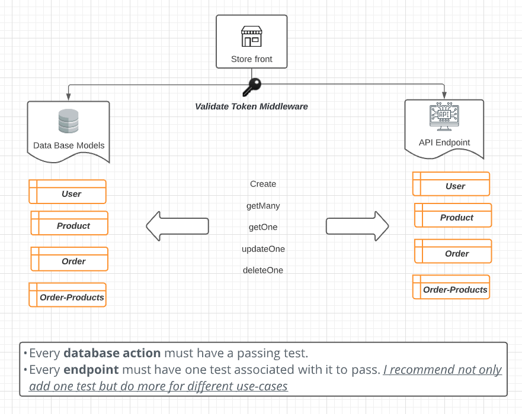

# Storefront Backend Project

***

## Project Summary

We will be developing a Node JS application that will connect to a Postgres (SQL) database, and I will construct the database, tables, and columns to meet the project's needs. The database will be used to store user information like as names, email addresses, passwords, and so on, so that they may log in to the application using JWT. I designed a RESTful API for the frontend developer to use. In addition, I wrote tests, encrypted user information, and provided tokens for inclusion into the frontend.


***

## What I learned 
- Handling Error
- Handling environment variables
- Connecting Node to a Postgres Database
- Migration
- Models and Create Route
- CRUD Operation for Route
- Password hash creation and validation with Bcrypt
- Add Validate Token Middle ware
- Add unit testing for Models and Auth
***
## Technologies and tools
- Typescript 
- db-migrate 
- PostgreSQL 
- Jasmine
- Eslint
- Express JS
- Prettier
***

## Prerequisites installation
Your machine must have the following installed on it:
- [Node/NPM](https://nodejs.org/en/download/) (v16 or higher)
*** 

## Setup

### 1. Install Dependencies
After Cloning the project, head inside the project folder and run
```
npm install
```
### 2. Set up the database
1- connect to default postgres database `psql -U postgres`

2- in psql, run the following to create user : `CREATE USER shopping_user WITH PASSWORD 'password123';`

3- In psql, run the following to create dev and test

`CREATE DATABASE shopping;`
`CREATE DATABASE shopping_test;`

4- grant the dev database

`\c shopping`

`GRANT ALL PRIVILEGES ON DATABASE shopping To shopping_user;`

5- grant the test database

`\c shopping`

`GRANT ALL PRIVILEGES ON DATABASE shopping_test To shopping_user;`
### 3.  DB Creation and Migrations
```
cp .env.example .env
```
Now, replace .env with your credentials 
```
# dev | test | prod
NODE_ENV=dev
PORT=3000
DB_HOST=localhost
DB_NAME=store_dev
DB_TEST_NAME =store_test
DB_USERNAME= Your DB name
DB_PASSWORD= Your DB password
JWT_KEY= Your JWT key
SALT_PASS= Your salt 
SALT_ROUNDS= Your salt rounds
```
and then run
``` 
npm run migrate:up
```

### 4. Starting the project
```
npm start
```
By now you should be able to go to entry point `http://localhost:3000` 

### 5. Running the tests
* For mac
```
test:mac
```
* For windows
```
test:win
```
To test that everything is working as expected.
***
## Endpoints
- [REQUIREMENTS.md](REQUIREMENTS.md)

## Database Schema
- [REQUIREMENTS.md](REQUIREMENTS.md)
